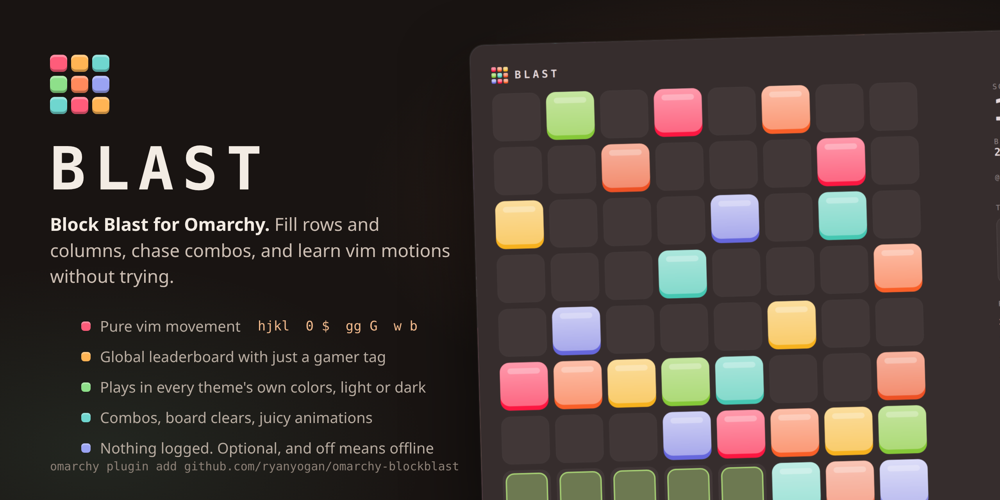
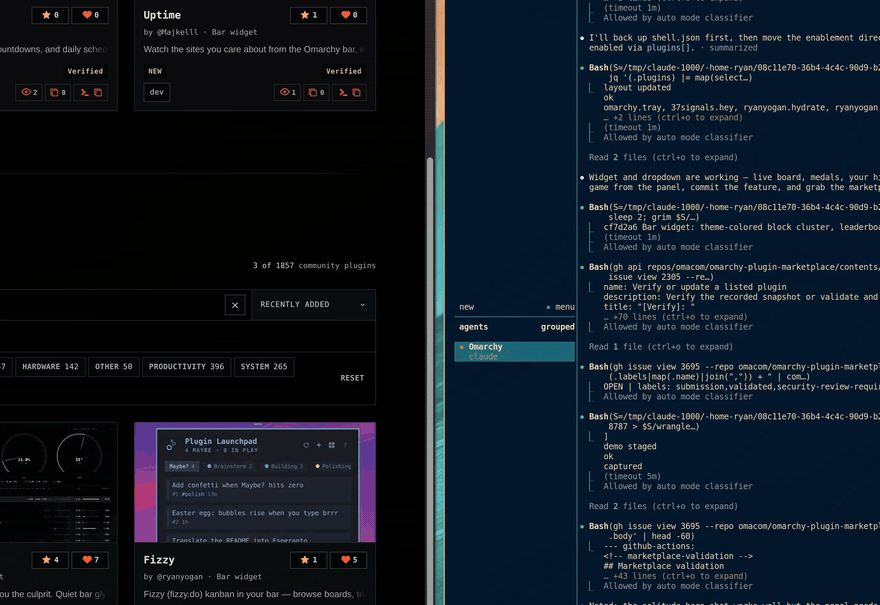
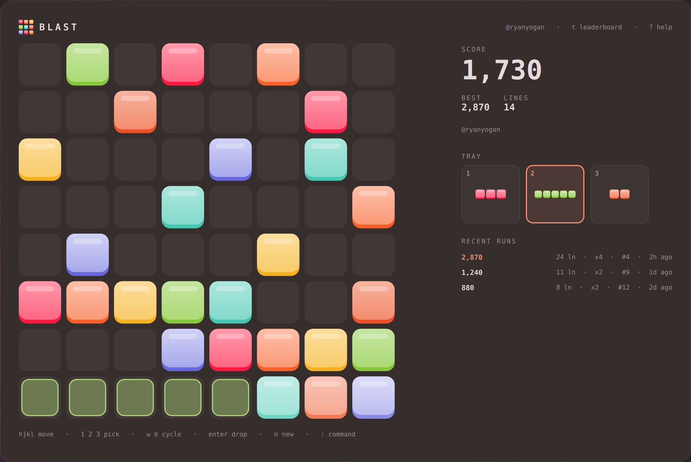
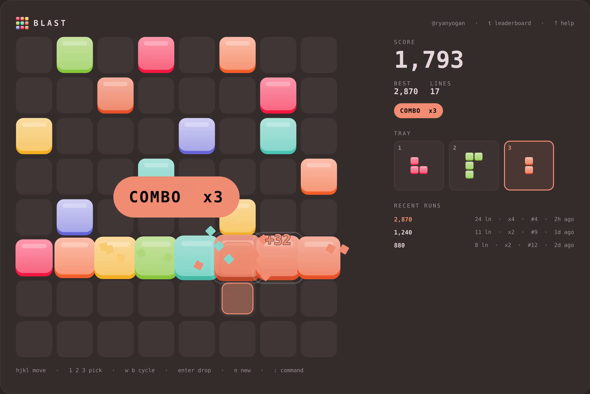
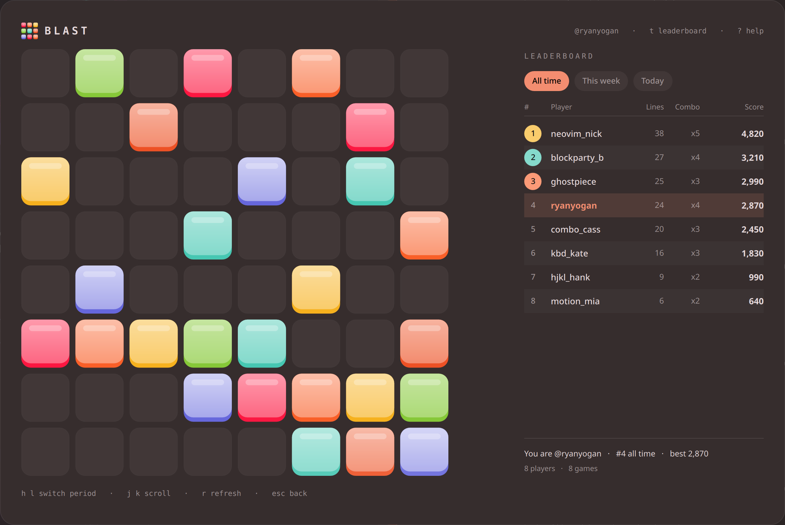
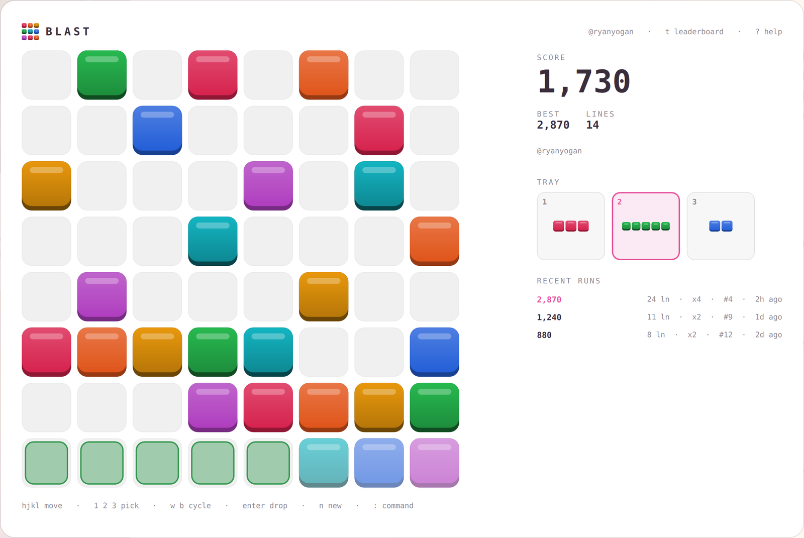

# Blast 🧱

Block Blast for Omarchy. An 8x8 board, three pieces on the tray, vim keys, big combos, and a global leaderboard under a gamer tag. It launches like an app: no bar widget, nothing running when it is closed.



Three clears, a rising combo, and a quick look at the world:



## Install

```bash
omarchy plugin add https://github.com/ryanyogan/omarchy-blockblast.git --enable --yes
~/.config/omarchy/plugins/ryanyogan.blast/install.sh
```

The second line puts **Blast** in your app menu. Or bind it:

```lua
o.bind("SUPER + CTRL + B", "Blast", "omarchy-shell shell toggle ryanyogan.blast '{}'")
```

## Play

Drop pieces anywhere they fit. Fill a row or a column and it clears. No gravity. The game ends when nothing on the tray fits.

| Keys | |
|---|---|
| `h j k l` | move the piece |
| `0` `$` `gg` `G` | jump to an edge |
| `1` `2` `3` | pick a tray slot |
| `w` `b` `tab` | next / previous piece |
| `enter` `space` | drop |
| `n` | new game |
| `t` | leaderboard |
| `?` | help |
| `:` | command line |
| `esc` `q` | back, then quit |

**Scoring.** One point per block. A clear pays 10, two lines at once 30, three 60, four 100. Every consecutive clearing move adds one to your combo, and the combo multiplies the clear. Empty the board for 300 on top.

**Commands.** `:tag NAME` claims a gamer tag. `:leaderboard off` turns off all networking, `:opacity 20-100` sets how much the background dims (`:opacity default` resets), `:motion off` stills the animations, plus `:new`, `:api URL`, `:logout`, `:q`.

## Screens

| A bar of five over a full row | Combo x3, mid-blast |
|---|---|
|  |  |

| The world | Any theme, light or dark |
|---|---|
|  |  |

## Leaderboard

Press `r` at game over (or `:tag NAME` any time) to pick a gamer tag. That is the whole sign-up: the tag and your scores are all the server keeps. No email, no logging, nothing tracked. `:logout` forgets the tag on this machine.

The scoreboard also lives on the web at the Worker's URL.

## Theming

Block colors come from the active theme's `colors.toml` (red, orange, yellow, green, cyan, blue, magenta), so each theme plays in its own palette. Light themes get a light surface. Text, accents and surfaces follow the shell.

## Backend

`worker/` is a Cloudflare Worker with a D1 database. Deploy your own:

```bash
cd worker
npm install
npx wrangler login
./deploy.sh
```

`deploy.sh` creates the database, runs migrations, deploys, and points `Service.qml` at the new URL. Anyone can also aim the plugin at any instance with `:api https://...`.

Run it locally with `npm run db:local && npm run dev`, then `:api http://localhost:8787` in the game. `npm test` runs the API suite against that.

| Route | |
|---|---|
| `GET /` | scoreboard page |
| `POST /v1/players` `{tag}` | claim a tag, returns a token |
| `POST /v1/players/verify` `{token}` | your stats |
| `DELETE /v1/players` `{token}` | leave |
| `GET /v1/players/:tag` | profile |
| `POST /v1/scores` `{token, score, ...}` | post a finished run |
| `GET /v1/leaderboard?period=all\|week\|day` | the board |

## Performance

Closed, Blast does not exist: the shell unloads the overlay and the service holds no timers, processes, or sockets. Open, ambient motion (the ghost's breathing, the tray bob, the clear pulse) runs only for five seconds after your last keypress, then the scene goes still, so an idle board costs roughly nothing. `:motion off` removes motion entirely.

## Development

The game rules are in `Game.js` with no QML in them; `node test/game.test.js` runs them under node. State lives in `~/.local/state/blast/blast.json`. The shell's hot reload does not always pick up a symlinked plugin, so `omarchy-restart-shell` after edits.

## License

MIT
